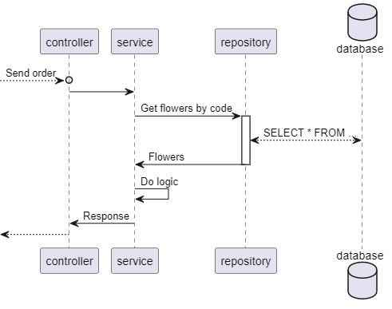
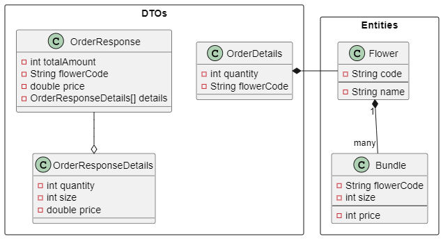

# Proposed solution

I developed this application in Java 1.8 using SpringBoot framework.
I made this choice to show you the technologies I use in my daily work.

I created a RESTful service that exposes two endpoint:
* `[GET] /shop` that returns the list of all available flowers and bundles
* `[POST] /shop` that allow to compute the required task. In particular, this last endpoint takes in input a list of
  strings that represents the input described in the exercise text.

In the image below, I represented a simple sequence diagram, describing the POST endpoint workflow.

All the business logic that implements the solution algorithm is contained in the `FlowerShopService` class where I
commented step by step all the architectural choices.

The final result is a *find first*  )  implementation for the
*bin packaging problem*, where, for each flower:
* the bin is the quantity of ordered flowers;
* the items are the bundles, that have to fit inside the bin

To simplify the data exchange, I used an in-memory H2 database. In this way you should be able to keep up all the
environment, only executing the single maven project.

The class interaction is the following (in the **Entities** package is represented the database structure):

Finally, to validate the implemented algorithm I added some simple Unit test, using `JUnit` and `Mockito`.
